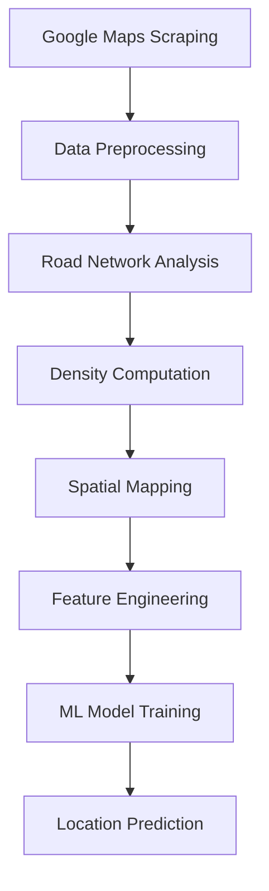

# Enhancing Urban Mobility and Leveraging Urban Site Selection

A comprehensive machine learning project that combines geospatial analysis, web scraping, and predictive modeling to optimize urban site selection based on mobility patterns, infrastructure density, and location characteristics.

## 📋 Project Overview

This project aims to enhance urban mobility planning and site selection by:
- **Web scraping** location data from Google Maps using Selenium
- **Geospatial analysis** using OpenStreetMap (OSM) data to calculate road network metrics
- **Density mapping** through convolution-based spatial analysis
- **Predictive modeling** using Random Forest and Gradient Boosting algorithms to predict optimal locations

## 🎯 Key Features

- **Automated Data Collection**: Scrapes venue data (name, rating, reviews, coordinates) from Google Maps
- **Road Network Analysis**: Calculates distances to primary and secondary roads using OSMnx
- **Spatial Density Analysis**: Computes node density and applies convolution kernels for spatial smoothing
- **Machine Learning Models**: Predicts optimal coordinates for various venue categories
- **Multi-Category Support**: Handles 16+ venue categories including shops, hospitals, educational institutes, etc.

## 🏗️ Project Structure

```
Enhancing Urban Mobility and leveraging Urban Site Selection/
├── Dataset/                          # Raw and processed datasets
│   ├── dataset.csv                   # Main scraped dataset
│   └── Event Venue_folder/           # Category-specific data
├── Dataset-2/                        # Secondary dataset storage
├── Model Training/                   # Core scripts and models
│   ├── mai.py                        # Google Maps web scraper
│   ├── main.py                       # Data preprocessing
│   ├── main1.py                      # Road network analysis
│   ├── main2.py                      # Density computation
│   ├── main3.py                      # Spatial mapping
│   ├── mode.py                       # ML model training
│   ├── data.ipynb                    # Data exploration notebook
│   ├── files.ipynb                   # File processing notebook
│   ├── maker.ipynb                   # Data generation notebook
│   └── filtered_data_files/          # Processed data outputs
└── README.md                         # Project documentation
```

## 🔧 Technologies Used

### Core Libraries
- **Web Scraping**: Selenium, BeautifulSoup4
- **Geospatial Analysis**: OSMnx, NetworkX, Shapely, Geopy
- **Data Processing**: Pandas, NumPy
- **Machine Learning**: Scikit-learn (RandomForest, GradientBoosting)
- **Visualization**: Matplotlib
- **Automation**: PyAutoGUI

### Key Dependencies
```
selenium
beautifulsoup4
osmnx
networkx
pandas
numpy
scikit-learn
matplotlib
shapely
geopy
scipy
```

## 🚀 Getting Started

### Prerequisites
- Python 3.8+
- Chrome WebDriver (for Selenium)
- Internet connection (for OSM data)

### Installation

1. **Clone the repository**
```bash
git clone https://github.com/Sarvanpilli/Enhancing-Urban-Mobility-and-leveraging-Urban-Site-Selection--Machine-Learning-Project.git
cd "Enhancing Urban Mobility and leveraging Urban Site Selection"
```

2. **Install dependencies**
```bash
pip install selenium beautifulsoup4 osmnx networkx pandas numpy scikit-learn matplotlib shapely geopy scipy pyautogui
```

3. **Download Chrome WebDriver**
   - Download from [ChromeDriver](https://chromedriver.chromium.org/)
   - Add to system PATH or place in project directory

## 📊 Usage

### 1. Data Collection (Web Scraping)

Scrape venue data from Google Maps:

```bash
python "Model Training/mai.py"
```

**Configuration**: Edit the bounding box coordinates in `mai.py`:
```python
move_rectangle(38.8363592557036, -77.04835828729044,
               38.97469056279769, -77.01340485076507,
               driver, 950, 600, categories)
```

### 2. Data Preprocessing

Clean and prepare the dataset:

```bash
python "Model Training/main.py"
```

This script:
- Removes duplicate entries
- Handles missing values using mean imputation
- Outputs: `Dataset/updated_dataset1.csv`

### 3. Road Network Analysis

Calculate distances to primary and secondary roads:

```bash
python "Model Training/main1.py"
```

**Features**:
- Finds nearest primary/secondary roads for each location
- Uses Haversine distance calculations
- Outputs: `Dataset/updated_dataset2.csv`

### 4. Density Computation

Compute spatial density using node counts:

```bash
python "Model Training/main2.py"
```

**Process**:
- Divides area into n×n grid blocks
- Counts OSM nodes in each block
- Applies convolution kernel for smoothing
- Outputs: `Dataset/node_counts.csv`, `Dataset/convolution_result.csv`

### 5. Spatial Mapping

Map locations to density grid:

```bash
python "Model Training/main3.py"
```

Assigns each location to its corresponding grid cell with density value.

### 6. Model Training

Train ML models to predict optimal locations:

```bash
python "Model Training/mode.py"
```

**Models**:
- Random Forest Regressor
- Gradient Boosting Regressor

**Metrics**: MSE, R-squared for latitude and longitude predictions

## 📈 Workflow Pipeline



## 🗺️ Supported Venue Categories

The project supports 16 major categories with 100+ subcategories:

- **Shop**: Stationery, Clothing, Electronics, Grocery, etc.
- **Shopping Mall**: Department Store, Food Court, Cinema
- **Fuel Station**: EV Charging, Petrol Pump, LPG
- **Office**: Corporate, Co-working, Law Firm
- **Pilgrimage Place**: Temple, Church, Mosque
- **Restaurant**: Fast Food, Fine Dining, Cafe
- **Entertainment**: Theater, Museum, Sports Complex
- **Hotel**: Budget, Luxury, Resort
- **Hospital**: General, Specialty, Dental Clinic
- **Educational Institute**: School, College, University
- **Financial Institution**: Bank, ATM
- **Government Building**: Post Office, Police Station
- **Outdoor Space**: Park, Garden, Lake
- **Transportation**: Airport, Train Station, Bus Stop
- **Personal Care**: Laundry, Hair Salon
- **Event Venue**: Conference Center, Stadium

## 🔬 Methodology

### 1. Haversine Distance Calculation
Calculates great-circle distances between coordinates:

```python
distance = R * 2 * atan2(sqrt(a), sqrt(1-a))
where a = sin²(Δlat/2) + cos(lat1) * cos(lat2) * sin²(Δlon/2)
```

### 2. Convolution Kernel
7×7 kernel for spatial smoothing:

```python
kernel = [[0.2, 0.2, 0.2, 0.2, 0.2, 0.2, 0.2],
          [0.2, 0.4, 0.4, 0.4, 0.4, 0.4, 0.2],
          [0.2, 0.4, 0.6, 0.6, 0.6, 0.4, 0.2],
          [0.2, 0.4, 0.6, 0.8, 0.6, 0.4, 0.2],
          [0.2, 0.4, 0.6, 0.6, 0.6, 0.4, 0.2],
          [0.2, 0.4, 0.4, 0.4, 0.4, 0.4, 0.2],
          [0.2, 0.2, 0.2, 0.2, 0.2, 0.2, 0.2]]
```

### 3. Feature Engineering
- One-hot encoding for categories and subcategories
- Spatial features: row, column, density value
- Road proximity features

## 📝 Data Schema

### Scraped Data (`dataset.csv`)
| Column | Type | Description |
|--------|------|-------------|
| Name | String | Venue name |
| Rating | Float | Google Maps rating (0-5) |
| Number of Reviews | Integer | Review count |
| Latitude | Float | Latitude coordinate |
| Longitude | Float | Longitude coordinate |
| Category | String | Main category |
| Sub-Category | String | Specific subcategory |

### Enhanced Data (`dataset1.csv`)
Additional columns:
- `Nearest_Primary_Road Distance` (meters)
- `Nearest_Secondary_Road Distance` (meters)
- `Row`, `Column` (grid position)
- `Value` (density score)

## 🎯 Model Performance

Models are evaluated using:
- **Mean Squared Error (MSE)**: Measures prediction accuracy
- **R-squared (R²)**: Explains variance in predictions

Both Random Forest and Gradient Boosting models predict latitude and longitude separately.

## ⚠️ Important Notes

1. **Web Scraping**: Respect Google Maps Terms of Service and rate limits
2. **Coordinates**: Update bounding box coordinates for your target area
3. **Grid Size**: Adjust `n` parameter (default: 6×6) based on area size
4. **Radius**: Modify density calculation radius (default: 700m)
5. **Chrome Driver**: Ensure ChromeDriver version matches your Chrome browser

## 🐛 Troubleshooting

### Common Issues

**Selenium WebDriver Error**
```bash
# Ensure ChromeDriver is in PATH or specify path
driver = webdriver.Chrome(executable_path='/path/to/chromedriver')
```

**OSMnx No Data Error**
- Check internet connection
- Verify bounding box coordinates are valid
- Reduce search radius if area has sparse data

**Memory Issues**
- Reduce grid size (`n` parameter)
- Process data in smaller batches
- Use `filtered_data_files` for intermediate storage

## 🤝 Contributing

Contributions are welcome! Please:
1. Fork the repository
2. Create a feature branch
3. Commit your changes
4. Push to the branch
5. Open a Pull Request

## 📄 License

This project is open-source and available for educational and research purposes.

## 👥 Authors

- **Sarvan Sri Sai Pilli** - [GitHub](https://github.com/Sarvanpilli)

## 🙏 Acknowledgments

- OpenStreetMap contributors for geospatial data
- OSMnx library for network analysis tools
- Scikit-learn for machine learning algorithms

## 📧 Contact

For questions or collaboration opportunities, please open an issue on GitHub.

---

**Note**: This project is for academic and research purposes. Ensure compliance with data usage policies and terms of service when scraping web data.
